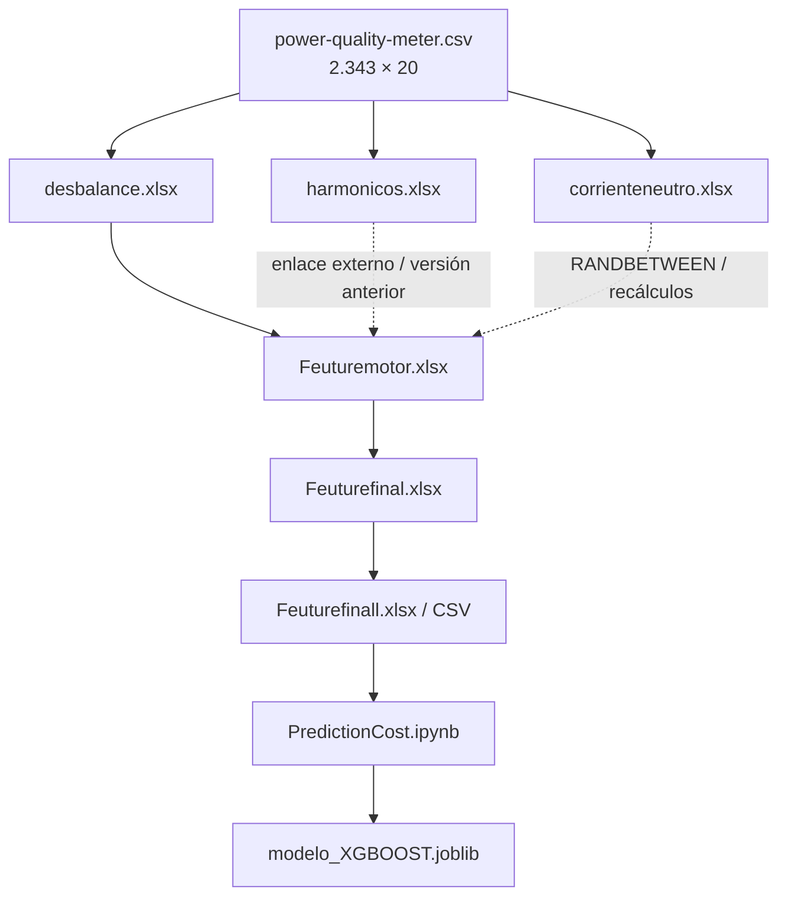
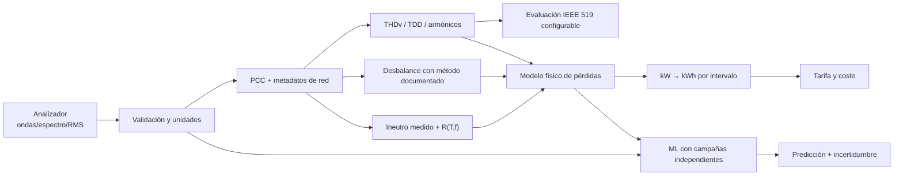

# Recuperación y auditoría de un prototipo de estimación de pérdidas por calidad de energía mediante XGBoost

## Resumen

Este documento reconstruye un proyecto desarrollado en 2021 para analizar
mediciones de un analizador de red, estimar costos asociados con energía
reactiva, desbalance, armónicos y corriente neutra, y entrenar un modelo
XGBoost. El proyecto tenía como intención comparar indicadores de calidad de
energía con IEEE 519 y calcular potencia o costo “perdido”.

La recuperación identificó 13 archivos principales: un CSV con 2.343
mediciones, seis libros de cálculo y consolidación, dos versiones del dataset
final, dos notebooks y un modelo serializado. El flujo original pudo
reconstruirse completamente a nivel de columnas y fórmulas.

El hallazgo central es que el proyecto fue un **prototipo exploratorio**, no
una calculadora validada de kW perdidos ni una evaluación completa de
conformidad con IEEE 519. Las hojas sí construyen indicadores y costos, pero
contienen inconsistencias de unidades, supuestos constantes, una corriente
neutra aleatoria y ramas de cálculo no sincronizadas. El modelo XGBoost no
predice directamente kW perdidos: predice `costolineabase`, un costo derivado
de la potencia activa.

Una reimplementación auditable, sin fuga de la variable objetivo y con
separación temporal ordenada, obtuvo `R² = 0,7510`, `MAE = 39.277,72` y
`RMSE = 91.180,71` sobre las últimas 469 observaciones. Estas métricas
demuestran que existe señal predictiva dentro de la campaña recuperada, pero
no validan las ecuaciones físicas ni permiten generalizar a otra instalación.

**Palabras clave:** calidad de energía, pérdidas eléctricas, IEEE 519,
XGBoost, armónicos, desbalance, corriente neutra, analizador de red.

---

## 1. Contexto empresarial y procedencia

La evidencia recuperada identifica las siguientes organizaciones:

| Papel | Organización | Evidencia |
|---|---|---|
| Cliente asociado en los informes de la plataforma | **Aluminios de Colombia S.A. – ALUCOL** | Informes operativos adyacentes titulados “Informe Plataforma Zircular”, con ALUCOL como cliente |
| Plataforma | **Zircular** | Portada de los informes operativos |
| Autor organizacional de los libros | **ZION ING** | Metadatos `creator` de los Excel de desbalance, armónicos, corriente neutra y consolidación |
| Modificación posterior | **Globaltgy Colombia** | Metadato `lastModifiedBy` de `Feuturefinall.xlsx` |

El responsable del proyecto confirmó para esta publicación que el trabajo se
realizó para **Aluminios de Colombia S.A. – ALUCOL**. El CSV recuperado
corresponde a mediciones de 2019; la construcción de las hojas, variables y
modelo se realizó principalmente en 2021. La recuperación y auditoría del
proyecto se efectuó en 2026.

El CSV no contiene dentro de sus columnas el nombre de la empresa, planta,
tablero o medidor. La atribución empresarial se documenta a partir de la
confirmación del responsable y de los informes de la plataforma conservados
junto al proyecto.

No se publican en este repositorio direcciones, teléfonos, correos ni nombres
de contacto encontrados en los informes, porque no son necesarios para
explicar el proyecto.

---

## 2. Objetivo original reconstruido

El proyecto buscaba:

1. tomar variables eléctricas de un analizador de red;
2. estimar pérdidas o potencia no aprovechada por:
   - desbalance de tensión y corriente;
   - distorsión armónica;
   - corriente en el neutro;
   - energía reactiva;
3. convertir esas magnitudes a un costo;
4. construir un dataset de variables económicas;
5. entrenar XGBoost para predecir el costo de la línea base;
6. relacionar el análisis de armónicos con IEEE 519.

El objetivo fue parcialmente logrado: se construyó el flujo de datos, se
programaron fórmulas, se entrenó y guardó un modelo. No se logró una medición
física validada de pérdidas ni una prueba completa de cumplimiento normativo.

---

## 3. Material recuperado

| Archivo | Contenido | Filas útiles |
|---|---|---:|
| `power-quality-meter.csv` | Exportación del analizador | 2.343 |
| `desbalance.xlsx` | Fórmulas de desbalance y pérdida asociada | 2.343 |
| `harmonicos.xlsx` | Fórmulas de armónicos | 2.343 |
| `corrienteneutro.xlsx` | Primera versión de corriente neutra | 2.343 |
| `Copia de corrienteneutro.xlsx` | Versión posterior de corriente neutra | 2.343 |
| `Feuturemotor.xlsx` | Consolidación técnica y económica | 2.343 |
| `Feuturefinal.xlsx` | Selección intermedia mediante enlaces externos | 2.343 |
| `Feuturefinall.xlsx` | Dataset de ML congelado | 2.343 |
| `Feuturefinall.csv` | Dataset leído por Python | 2.343 |
| `PredictionCost.ipynb` | Entrenamiento XGBoost | 2.343 |
| `modelo_XGBOOST.joblib` | Modelo histórico serializado | — |
| `Untitled.ipynb` | Notebook vacío | — |
| `costo usuario servidor.xlsx` | Estimación de almacenamiento AWS | No central |

Los dos CSV reales se publican en `data/raw/` y `data/processed/`. Los libros,
notebooks, documentos de terceros y binarios originales se conservan en
`private/originals/`, con hashes SHA-256, y se excluyen de Git. La lista
completa está en [`docs/source-inventory.md`](docs/source-inventory.md).

---

## 4. Datos del analizador

### 4.1 Cobertura temporal

- Inicio: **31 de agosto de 2019, 15:21:43.135**
- Fin: **1 de septiembre de 2019, 10:52:43.135**
- Duración: **19 horas y 31 minutos**
- Intervalo: **30 segundos**, constante en los 2.342 saltos
- Registros: **2.343**
- Variables originales: **19**, más un índice exportado
- Valores nulos: **0**

### 4.2 Variables

Se recuperaron:

- tensión RMS fase-neutro A, B y C;
- tensión neutro-tierra;
- corriente RMS A, B y C;
- ángulo de corriente A, B y C;
- potencia activa, aparente y reactiva total;
- factor de potencia por fase y total.

No existen en el CSV:

- espectro de armónicos;
- THDv medido;
- THDi o TDD medido/calculable;
- corriente RMS del neutro;
- frecuencia medida;
- identificación del PCC;
- corriente máxima de demanda `IL`;
- corriente de cortocircuito `Isc`.

### 4.3 Resumen estadístico

Los valores siguientes incluyen los registros anómalos:

| Variable | Mínimo | Mediana | Media | Percentil 95 | Máximo |
|---|---:|---:|---:|---:|---:|
| Tensión fase A (V) | 0,20 | 244,40 | 243,28 | 250,72 | 253,66 |
| Tensión fase B (V) | 0,02 | 244,00 | 242,86 | 250,58 | 254,78 |
| Tensión fase C (V) | 0,06 | 244,50 | 243,19 | 250,76 | 253,16 |
| Corriente A (A) | 0,10 | 756,80 | 738,98 | 889,29 | 6.276,70 |
| Corriente B (A) | 0,10 | 699,30 | 680,94 | 826,59 | 6.276,70 |
| Corriente C (A) | 0,10 | 647,40 | 623,05 | 772,14 | 835,30 |
| Potencia activa total | 0 | 509.100 | 498.684 | 602.235 | 4.915.050 |
| Potencia reactiva total | -46.050 | 42.450 | 54.311 | 87.585 | 4.915.050 |
| Factor de potencia total | 0 | 1,00 | 1,545 | 1,00 | 327,67 |

Las unidades de potencia se interpretan como W, VA y var porque los libros las
dividen por 1.000. Deben confirmarse contra la configuración del medidor.

### 4.4 Anomalías identificadas

Cuatro filas —índices 289, 1919, 1973 y 2307— contienen simultáneamente
potencias de `4.915.050` y factores de potencia de `327,67`. Representan
**0,1707 %** de las observaciones y son marcadores típicos de error, saturación
o valor centinela del equipo/exportación.

También hay:

- 17 filas con potencia activa igual a cero;
- 17 filas con potencia aparente igual a cero;
- 18 filas con potencia reactiva igual a cero;
- tensiones de fase cercanas a cero en los mismos períodos anómalos o de
  desconexión.

El código nuevo no elimina estas filas automáticamente: las reporta para que
la regla de limpieza sea explícita y trazable.

---

## 5. Flujo de procesamiento reconstruido



Las seis variables de tensión y corriente copiadas a `desbalance.xlsx` y
`harmonicos.xlsx` coinciden exactamente con el CSV en las 2.343 filas. La rama
de desbalance también coincide con la consolidación económica en 2.343 de
2.343 filas.

Las ramas de armónicos y corriente neutra no quedaron sincronizadas:

- el indicador actual de `harmonicos.xlsx` coincide con el valor importado en
  `Feuturemotor.xlsx` en solo **23 de 2.343 filas**;
- el indicador actual de `Copia de corrienteneutro.xlsx` coincide con
  `Feuturemotor.xlsx` en solo **18 de 2.343 filas**;
- la diferencia máxima de la rama armónica es `12,121889514` unidades del
  indicador;
- la diferencia máxima de la rama del neutro es `1.847,2330716` unidades del
  indicador;
- el dataset final sí conserva íntegramente los costos reactivo y armónico de
  una versión de la consolidación, pero la columna final de corriente neutra
  solo coincide con `Feuturemotor.xlsx` en 18 filas.

La causa más probable es una combinación de enlaces externos rotos, versiones
anteriores de los libros y recálculo aleatorio de `RANDBETWEEN`.

---

## 6. Fórmulas recuperadas

### 6.1 Desbalance

Para tensiones `VA`, `VB`, `VC` y corrientes `IA`, `IB`, `IC`:

```text
Vprom = (VA + VB + VC) / 3
Iprom = (IA + IB + IC) / 3

ΔVmax = max(|VA - VB|, |VB - VC|, |VC - VA|)
ΔImax = max(|IA - IB|, |IB - IC|, |IC - IA|)

DesbalanceV_% = 100 × ΔVmax / Vprom
DesbalanceI_% = 100 × ΔImax / Iprom

Sproxy_VA = ΔVmax × ΔImax
Pproxy_W  = Sproxy_VA × FP
Pproxy_kW = Pproxy_W / 1000
```

La hoja original rotula `Pproxy_W` como “kW perdidos”, pero no divide por
1.000. El nombre correcto dimensionalmente es W.

#### Ejemplo: primera fila

```text
VA, VB, VC = 242,58; 241,98; 242,12 V
IA, IB, IC = 596,00; 544,70; 496,30 A
FP         = 0,99

Vprom = 242,2267 V
Iprom = 545,6667 A
ΔVmax = 0,60 V
ΔImax = 99,70 A

DesbalanceV = 0,2477 %
DesbalanceI = 18,2712 %
Sproxy      = 59,8200 VA
Pproxy      = 59,2218 W = 0,0592218 kW
```

Este resultado reproduce exactamente el Excel. No prueba que toda esa
magnitud sea una pérdida física real: es un indicador construido a partir de
diferencias entre fases.

### 6.2 Corriente neutra

La ecuación utilizada es:

```text
Pneutro_W = Ineutro² × R
Pajustada = Pneutro_W × FP
```

El libro fija `R = 0,15 Ω`, pero el valor llamado corriente neutra es generado
con `RANDBETWEEN`, entre 0 y 9,24 A, sin semilla. Para la primera fila:

```text
Ineutro = 9,24 A
R       = 0,15 Ω
FP      = 0,99

Pneutro = 9,24² × 0,15 = 12,80664 W
Pajustada = 12,6785736 W
```

La hoja vuelve a rotular W como kW. La versión nueva conserva `I²R`, exige una
corriente realmente medida e informa W y kW por separado. Multiplicar una
pérdida resistiva por factor de potencia no forma parte de `I²R`; se conserva
solo para reproducibilidad histórica.

### 6.3 Armónicos

Las seis columnas THD del libro son constantes:

```text
THDv_A = THDv_B = THDv_C = 0,03
THDi_A = THDi_B = THDi_C = 0,02
```

No provienen del analizador. La fórmula reconstruida es:

```text
A = max(Vprom × THDv_A,
        Iprom × THDi_A,
        THDv_B × THDv_C)

B = max(THDi_A × THDi_B,
        THDv_B × THDv_C,
        THDi_B × THDi_C)

Score_armónico = A × B × FP_B
```

En la primera fila:

```text
A = max(7,2668; 10,913333; 0,0009) = 10,913333
B = max(0,0004; 0,0009; 0,0004) = 0,0009
Score = 10,913333 × 0,0009 × 0,96 = 0,00942912
```

La fórmula mezcla V, A y porcentajes, por lo que el resultado no tiene una
unidad coherente de VA o W. Se conserva como `legacy_harmonic_score`, no como
kW.

### 6.4 Conversión económica

El libro usa una tarifa constante de `500`, presumiblemente COP/kWh:

```text
Costo_base     = (Potencia_activa / 1000) × 500
Costo_reactiva = (Potencia_reactiva / 1000) × 500
Costo_desb     = Pproxy_W × 500
Costo_arm      = Score_armónico × 500
Costo_neutro   = Score_neutro × 500
```

No integra el intervalo de 30 segundos. Para convertir potencia activa en
energía por fila debería usarse:

```text
E_kWh = P_kW × (30 / 3600)
Costo_fila = E_kWh × Tarifa_COP_kWh
```

En la primera fila, la hoja calcula:

```text
389,55 kW × 500 = 194.775
```

Si `500` es COP/kWh y la fila representa 30 segundos:

```text
389,55 kW × (30/3600) h × 500 COP/kWh = 1.623,125 COP
```

La línea base histórica queda multiplicada por 120 frente al costo energético
del intervalo. En desbalance se suma además el error W→kW: el costo histórico
de `29.610,90` para la primera fila sería `0,2467575 COP` si se interpretara el
proxy como una pérdida real de 0,0592218 kW durante 30 segundos. La diferencia
es un factor de 120.000.

Esta comparación depende de que la tarifa sea efectivamente COP/kWh. El libro
no documenta otra base temporal.

---

## 7. Comparación con IEEE 519

La edición activa localizada es
[IEEE 519-2022](https://standards.ieee.org/ieee/519/10677/), publicada en 2022
y aplicable a límites de distorsión en estado estable en el punto de
acoplamiento común (PCC).

Las magnitudes básicas son:

```text
THDv_% = 100 × sqrt(Σ(h=2..H) Vh²) / V1

TDDi_% = 100 × sqrt(Σ(h=2..H) Ih²) / IL

SCR = Isc / IL
```

donde:

- `V1` es la componente fundamental de tensión;
- `Vh` es la componente de tensión del armónico `h`;
- `Ih` es la componente de corriente del armónico `h`;
- `IL` es la corriente máxima de demanda;
- `Isc` es la corriente de cortocircuito disponible en el PCC.

Los límites no son un único 3 %, 5 % u 8 % aplicable a cualquier instalación:
dependen de la métrica, tensión, orden armónico y contexto de corriente/PCC.
Por eso el repositorio no copia una tabla normativa; recibe límites
seleccionados por un profesional con acceso a la edición aplicable.

### Resultado de la auditoría normativa

| Requisito | Disponible | Resultado |
|---|---|---|
| PCC identificado | No | No evaluable |
| Tensión nominal en PCC | No documentada | No evaluable |
| THDv real | No | No evaluable |
| Armónicos individuales de tensión | No | No evaluable |
| TDD real | No | No evaluable |
| Armónicos individuales de corriente | No | No evaluable |
| `IL` | No | No evaluable |
| `Isc/IL` | No | No evaluable |
| Ventana estadística normativa | No | No evaluable |

**Conclusión:** el proyecto tenía la intención de comparar con IEEE 519, pero
los datos recuperados no permiten emitir una declaración de cumplimiento. Los
porcentajes constantes del Excel son supuestos, no resultados de una
comparación normativa.

Además, cumplimiento de un límite y pérdida energética son problemas
diferentes. IEEE 519 limita distorsión; no entrega automáticamente los kW
perdidos de una instalación.

---

## 8. Dataset de machine learning

### 8.1 Variables

```text
X = [
  costoreactiva,
  costodesbalance,
  costoarmonicos,
  costocorrienteneutra
]

y = costolineabase
```

### 8.2 Estadísticas

| Variable | Mínimo | Mediana | Media | Percentil 95 | Máximo |
|---|---:|---:|---:|---:|---:|
| `costoreactiva` | -23.025 | 21.225 | 27.155,35 | 43.792,50 | 2.457.525 |
| `costodesbalance` | 0 | 37.752 | 43.456,07 | 82.367 | 2.663.680,14 |
| `costoarmonicos` | 0 | 3,2504 | 4,6071 | 3,3185 | 1.087,3074 |
| `costocorrienteneutra` | 0 | 1.628,67 | 2.158,04 | 5.793,49 | 6.403,32 |
| `costolineabase` | 0 | 254.550 | 249.342,19 | 301.117,50 | 2.457.525 |

Los máximos extraordinarios de varias columnas provienen de las cuatro filas
anómalas del analizador.

### 8.3 Correlación con el objetivo

| Entrada | Correlación de Pearson con `costolineabase` |
|---|---:|
| `costoreactiva` | 0,9067 |
| `costoarmonicos` | 0,7682 |
| `costodesbalance` | 0,7320 |
| `costocorrienteneutra` | 0,0113 |

La correlación alta no implica causalidad. Todas las columnas se derivan de
la misma fila eléctrica y comparten tarifas, factores de potencia, errores y
valores centinela.

---

## 9. Modelo XGBoost histórico

El notebook usa Python 3.7.6, XGBoost 1.4.2, NumPy 1.18.1 y SciPy 1.4.1.
Realiza una división aleatoria 70/30 con `random_state=42`.

La búsqueda de hiperparámetros registró:

```text
reg_alpha    = 23
max_depth    = 7
learning_rate = 0,4
gamma        = 1
best_score   ≈ 0,8205
```

Sin embargo, esa búsqueda utilizó una matriz `X` que incluía
`costolineabase`, la misma variable usada como `y`. Esto es fuga de objetivo y
el puntaje no debe publicarse como desempeño real.

El modelo final guardado usa una variante con cuatro entradas y parámetros:

```text
booster          = gbtree
objective        = reg:squarederror
subsample        = 0,7
colsample_bytree = 0,7
eta              = 0,08
max_depth        = 7
gamma            = 1
reg_alpha        = 23
seed             = 42
rounds máximos   = 130
```

Las métricas registradas en el notebook fueron:

| Métrica histórica | Valor |
|---|---:|
| MAE | 22.408,03 |
| RMSE | 31.661,40 |
| MAPE | infinito |
| “Accuracy” = 100 − MAPE | infinito negativo |

MAPE falla porque `costolineabase` contiene 17 ceros. La función RMSPE
personalizada también aplica `expm1` a valores que no fueron transformados con
logaritmos, por lo que devuelve `NaN`.

---

## 10. Reentrenamiento auditable

Se reentrenó XGBoost 3.3.0 con:

- cuatro entradas, sin la variable objetivo;
- primeras 1.874 filas para entrenamiento;
- últimas 469 filas para prueba;
- separación ordenada 80/20;
- parada temprana;
- modelo guardado en JSON nativo;
- métricas resistentes a objetivos iguales a cero.

### Resultados reproducidos el 23 de julio de 2026

| Métrica | Resultado |
|---|---:|
| Mejor iteración | 359 |
| Árboles generados | 390 |
| MAE | 39.277,72 |
| RMSE | 91.180,71 |
| R² | 0,7510 |
| MAPE, objetivos no nulos | 15,5820 % |
| WAPE | 16,5912 % |
| sMAPE | 15,5218 % |

La diferencia frente al RMSE histórico es esperable: el *holdout* ordenado es
más exigente que una partición aleatoria de puntos consecutivos y no mezcla
vecinos temporales entre entrenamiento y prueba.

La importancia relativa por ganancia del nuevo modelo fue:

| Variable | Importancia por ganancia |
|---|---:|
| `costoreactiva` | 36,65 % |
| `costoarmonicos` | 28,45 % |
| `costodesbalance` | 23,94 % |
| `costocorrienteneutra` | 10,96 % |

Estas importancias describen el comportamiento del modelo sobre este dataset;
no son una distribución física de pérdidas.

---

## 11. Hallazgos principales

### Hallazgo 1 — El proyecto sí usó machine learning

Existe un pipeline XGBoost completo, búsqueda de hiperparámetros, evaluación,
predicción y serialización de modelo.

### Hallazgo 2 — El ML no calcula directamente kW perdidos

XGBoost predice `costolineabase`. Los indicadores de pérdida se calculan antes
en Excel. Por tanto, corregir el modelo no corrige las fórmulas físicas.

### Hallazgo 3 — La rama de desbalance es reproducible

Los datos de entrada y los resultados coinciden fila por fila entre el CSV, el
libro de desbalance y la consolidación. El problema está en la interpretación:
el resultado en W se rotuló como kW y se monetizó sin integrar tiempo.

### Hallazgo 4 — La rama armónica no usa mediciones reales

Los valores THD son constantes. La fórmula mezcla unidades y los valores
actuales del libro no coinciden con la versión consolidada en 2.320 filas.

### Hallazgo 5 — La corriente neutra es aleatoria

No se midió en el CSV. `RANDBETWEEN` hace que el dataset cambie con cada
recalculo y explica la pérdida de trazabilidad entre versiones.

### Hallazgo 6 — La monetización usa potencia como energía

El intervalo real es de 30 segundos, pero los costos no multiplican por
`30/3600`. En desbalance también falta convertir W a kW.

### Hallazgo 7 — Hay cuatro registros centinela/anómalos

Los valores `4.915.050` y `327,67` afectan máximos, medias, correlaciones y
entrenamiento. Deben investigarse con el manual/log del analizador.

### Hallazgo 8 — No es posible certificar IEEE 519

Faltan PCC, THDv, TDD, armónicos individuales, `IL`, `Isc` y ventanas de
agregación. Los límites fijos del Excel no sustituyen estos datos.

### Hallazgo 9 — El resultado ML es prometedor, pero no generalizable aún

`R² = 0,7510` en el tramo final muestra señal dentro de una sola campaña. Para
demostrar generalización se necesitan campañas independientes, trazabilidad
de cliente/equipo y variables físicas medidas.

---

## 12. Alcance real del proyecto

| Capacidad | Estado | Alcance demostrado |
|---|---|---|
| Ingesta de exportación de analizador | Logrado | 2.343 filas, 30 s |
| Cálculo histórico de desbalance | Logrado | Reproducible, con corrección de unidades pendiente |
| Cálculo físico de pérdida en neutro | Parcial | Ecuación válida, entrada aleatoria |
| Evaluación de armónicos | Parcial | Prototipo con supuestos, sin mediciones THD/espectro |
| Conversión a costo energético | Parcial | Tarifa aplicada, tiempo/unidades inconsistentes |
| Entrenamiento XGBoost | Logrado como prototipo | Modelo funcional sobre costos derivados |
| Predicción de kW perdidos | No demostrado | El objetivo es costo de línea base |
| Cumplimiento IEEE 519 | No demostrado | Información normativa insuficiente |
| Validación en otra instalación | No realizada | Una campaña recuperada |
| Uso en producción/facturación | Fuera de alcance | Requiere rediseño y validación |

La descripción pública correcta es:

> Prototipo exploratorio de analítica de calidad de energía que reconstruye
> indicadores de pérdidas/costos y aplica XGBoost a datos derivados de un
> analizador de red.

No debe presentarse como:

> Calculadora certificada de kW perdidos conforme a IEEE 519.

---

## 13. Arquitectura propuesta para una segunda versión



Requisitos mínimos:

1. conservar `Date`, `Time`, instalación, tablero, medidor y configuración;
2. registrar unidades en el esquema;
3. medir corriente neutra;
4. exportar armónicos individuales y componente fundamental;
5. documentar PCC, tensión, `IL` e `Isc`;
6. separar reglas normativas de ecuaciones de pérdidas;
7. convertir potencia a energía usando la duración real;
8. versionar tarifa, moneda y reglas de energía reactiva;
9. eliminar o explicar valores centinela;
10. evaluar por campañas completas, no por puntos aleatorios;
11. cuantificar incertidumbre del medidor y del modelo;
12. validar las ecuaciones con un ingeniero electricista y mediciones de
    referencia.

---

## 14. Reproducibilidad

Entorno validado:

```text
Python        3.12.13
XGBoost       3.3.0
pandas        2.3.3
NumPy         2.5.1
scikit-learn  1.9.0
pytest        8.4.2
```

Pruebas:

```text
9 pruebas ejecutadas
9 aprobadas
```

Comandos:

```bash
python3 -m venv .venv
source .venv/bin/activate
python -m pip install -e ".[dev,xgboost]"
pytest

pqloss audit-data data/raw/power-quality-meter.csv

pqloss train data/processed/model-features.csv \
  --model-output models/xgboost_model.json \
  --report-output reports/model-report.json
```

---

## 15. Conclusión

El proyecto tuvo un alcance mayor que una hoja de cálculo aislada: reunió una
campaña de analizador de red, desarrolló un motor de variables, convirtió
indicadores técnicos en variables económicas y aplicó XGBoost. Como prueba de
concepto de analítica energética, logró demostrar un flujo de extremo a
extremo y una relación predictiva relevante dentro de los datos disponibles.

Su principal límite es que la parte física y normativa no quedó validada. Los
kW se confundieron con W, la potencia se monetizó como energía sin integrar
los 30 segundos, los armónicos se sustituyeron por constantes y la corriente
neutra se generó aleatoriamente. El modelo aprendió esos resultados derivados;
no pudo convertirlos en verdad física.

La recuperación permite ahora presentar el trabajo con honestidad técnica:
como un prototipo de 2021 bien encaminado en integración de datos y machine
learning, acompañado por una auditoría que define exactamente qué funcionó,
qué no se puede afirmar y cómo evolucionarlo hacia una herramienta de calidad
de energía trazable.
