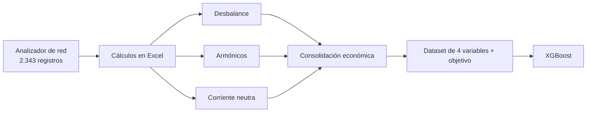

# Análisis de pérdidas por calidad de energía con ML

Recuperación y organización de un prototipo desarrollado en 2021 para estimar pérdidas/costos asociados con calidad de energía y entrenar un modelo XGBoost con datos de un analizador de red.

## Artículo técnico

La reconstrucción completa —empresa, datos, fórmulas, ejemplo numérico,
comparación IEEE 519, resultados del modelo, hallazgos y alcance— está en:

**[Leer el artículo técnico completo](ARTICULO_TECNICO.md)**

## Estado del proyecto

El proyecto original fue localizado, inventariado y auditado. El resultado se conserva como evidencia histórica en `private/originals/`, que Git ignora por seguridad. Este repositorio contiene una versión pública, documentada y reproducible.

Importante: el prototipo histórico **no demuestra conformidad con IEEE 519**. Sus hojas de cálculo usan supuestos fijos y algunas fórmulas con unidades inconsistentes. La versión organizada separa:

- cálculos históricos, identificados explícitamente como `legacy`;
- pérdidas físicas con unidades claras cuando los datos disponibles lo permiten;
- evaluación configurable contra límites suministrados por el usuario;
- entrenamiento ML sin incluir la variable objetivo entre las entradas.

## Qué se recuperó

- 2.343 mediciones del analizador de red, tomadas entre el 31 de agosto y el 1 de septiembre de 2019;
- hojas de cálculo de desbalance, armónicos, corriente neutra y costos;
- un conjunto de cinco variables para machine learning;
- un notebook de entrenamiento y un modelo XGBoost serializado;
- documentación de apoyo sobre monitoreo y medición de calidad de energía.

El modelo original usa cuatro entradas:

1. `costoreactiva`
2. `costodesbalance`
3. `costoarmonicos`
4. `costocorrienteneutra`

y trata de predecir `costolineabase`. Por tanto, el modelo predice un **costo base de energía activa**, no directamente los kW perdidos.

## Flujo reconstruido



## Inicio rápido

```bash
python3 -m venv .venv
source .venv/bin/activate
python -m pip install -e ".[dev,xgboost]"
pytest
```

Auditar el archivo original, si está disponible localmente:

```bash
pqloss audit-data \
  "private/originals/power-quality-meter.csv"
```

Entrenar una versión nueva del modelo:

```bash
pqloss train \
  "private/originals/Feuturefinall.csv" \
  --model-output models/xgboost_model.json \
  --report-output reports/model-report.json
```

Ejemplo de evaluación contra límites definidos por el usuario:

```bash
pqloss assess \
  --voltage-thd 4.1 \
  --voltage-thd-limit 5.0 \
  --current-tdd 6.2 \
  --current-tdd-limit 8.0
```

Los valores anteriores son solamente un ejemplo de uso de la interfaz; no son una tabla normativa incorporada.

## Estructura

- `src/power_quality_loss/`: cálculos, validación, evaluación y entrenamiento.
- `tests/`: pruebas de regresión para fórmulas y validaciones.
- `docs/`: metodología, auditoría, diccionario de datos e inventario.
- `data/sample/`: ejemplos sintéticos, no datos del cliente.
- `private/originals/`: archivo histórico local, excluido de Git.
- `references/`: enlaces y política de referencias.

## Resultados históricos y limitaciones

El notebook guardó MAE ≈ 22.408 y RMSE ≈ 31.661 en las unidades monetarias del dataset. Esos números no deben presentarse como desempeño certificado porque el experimento incluía problemas de validación, valores objetivo iguales a cero y una variante con fuga de la variable objetivo.

La revisión completa está en [docs/audit-findings.md](docs/audit-findings.md).

## Publicación

Antes de hacer público el repositorio hay que decidir la licencia y confirmar los derechos sobre las mediciones. Los archivos privados y las copias de normas o informes de terceros no se incluyen en Git. Consulte [docs/publication-checklist.md](docs/publication-checklist.md).
