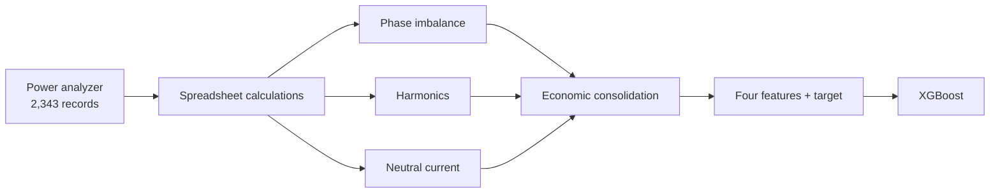

# Power-Quality Loss Analysis with Machine Learning

Recovery, audit, and reproducible implementation of a 2021 prototype that
estimated power-quality loss/cost indicators from power-analyzer data and
trained an XGBoost model.

| Field | Information |
|---|---|
| Company where the project was performed | **Aluminios de Colombia S.A. – ALUCOL** |
| Development | **ZION ING**, **Zircular** platform |
| Measurement period | **August 31–September 1, 2019** |
| Prototype development | **2021** |
| Recovery and technical audit | **2026** |
| License | **MIT — reuse permitted** |

## Technical article

The complete reconstruction—company context, data, formulas, worked example,
IEEE 519 analysis, model results, findings, and demonstrated scope—is here:

**[Read the complete technical article](TECHNICAL_ARTICLE.md)**

## Project status

The original project was located, inventoried, and audited. The real analyzer
and ML datasets are published under `data/`. Historical workbooks, third-party
documents, and the unsafe legacy `joblib` artifact remain in a private local
archive and are excluded from Git.

Important: the historical prototype **does not demonstrate IEEE 519
compliance**. Its workbooks use fixed assumptions and contain formulas with
inconsistent units. This repository separates:

- historical formulas, explicitly labeled `legacy`;
- physical losses with clear units when the available data support them;
- configurable comparison against user-supplied limits;
- ML training that never includes the target among the input features.

## Recovered scope

- 2,343 real analyzer measurements collected every 30 seconds from August 31
  to September 1, 2019;
- imbalance, harmonic, neutral-current, and economic-consolidation workbooks;
- a five-column machine-learning dataset;
- an XGBoost training notebook and serialized historical model;
- supporting power-quality monitoring and measurement references.

The published model schema uses four inputs:

1. `reactive_energy_cost`
2. `imbalance_cost`
3. `harmonic_cost`
4. `neutral_current_cost`

and predicts `baseline_active_energy_cost`. The model therefore predicts a
**baseline active-energy cost proxy**, not lost kW directly.

## Reconstructed data flow



## Quick start

Python 3.10 or newer is required.

```bash
python3 -m venv .venv
source .venv/bin/activate
python -m pip install -e ".[dev,xgboost]"
pytest
```

Audit the real analyzer export:

```bash
pqloss audit-data data/raw/power-quality-meter.csv
```

Reproduce the complete audit and XGBoost training workflow:

```bash
python scripts/reproduce_project.py
```

Train the model directly:

```bash
pqloss train \
  data/processed/model-features.csv \
  --model-output models/xgboost_model.json \
  --report-output reports/model-report.json
```

Example comparison against user-supplied distortion limits:

```bash
pqloss assess \
  --voltage-thd 4.1 \
  --voltage-thd-limit 5.0 \
  --current-tdd 6.2 \
  --current-tdd-limit 8.0
```

These percentages demonstrate the interface only; they are not embedded
standards-table values.

## Repository layout

- `src/power_quality_loss/`: formulas, validation, assessment, and training.
- `scripts/reproduce_project.py`: complete English reproduction workflow.
- `tests/`: regression tests for historical formulas and validation.
- `docs/`: methodology, audit, data dictionary, and source inventory.
- `data/raw/`: real power-analyzer measurements.
- `data/processed/`: real XGBoost feature dataset with English headers.
- `data/sample/`: synthetic examples for interface testing.
- `private/originals/`: local historical archive, excluded from Git.

## Results and limitations

The historical notebook recorded MAE ≈ 22,408 and RMSE ≈ 31,661 in the
dataset’s monetary units. Those numbers are not certified performance because
one experiment leaked the target, the target contained zero values, and the
split randomly mixed adjacent observations.

The corrected ordered-holdout run produced:

| Metric | Result |
|---|---:|
| MAE | 39,277.72 |
| RMSE | 91,180.71 |
| R² | 0.7510 |
| WAPE | 16.5912% |
| sMAPE | 15.5218% |

See [docs/audit-findings.md](docs/audit-findings.md) for the full audit.

## Data and reuse

The repository is published under the MIT License with authorization to name
ALUCOL, ZION ING, and Zircular and to reuse the two real CSV datasets. Personal
contacts, Office files with internal metadata, copies of IEEE standards, and
third-party reports are not included.
