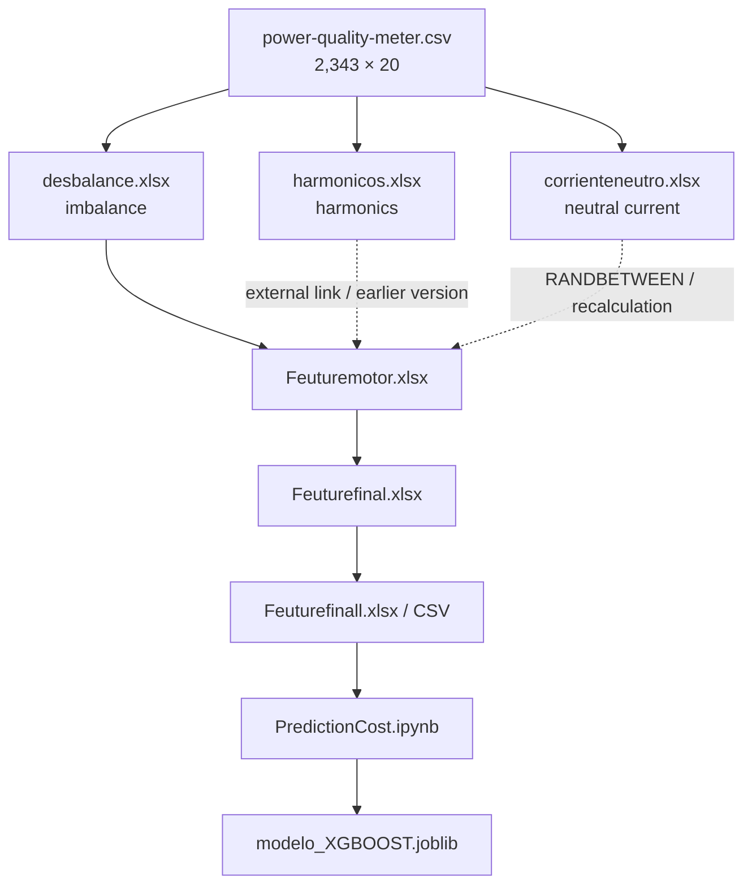
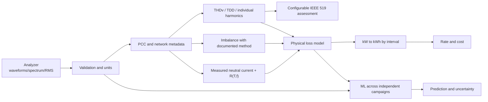

# Recovery and Audit of an XGBoost Prototype for Estimating Power-Quality Losses

## Abstract

This article reconstructs a project developed in 2021 to analyze power-analyzer
measurements, estimate costs associated with reactive energy, phase imbalance,
harmonics, and neutral current, and train an XGBoost model. The original intent
was to compare power-quality indicators with IEEE 519 and estimate power or
cost described as “lost.”

The recovery identified 13 primary artifacts: a CSV file with 2,343
measurements, six calculation and consolidation workbooks, two versions of the
final dataset, two notebooks, and a serialized model. The original data flow
and spreadsheet formulas were reconstructed at column level.

The central finding is that this was a valuable **exploratory prototype**, not
a validated lost-kW calculator or a complete IEEE 519 compliance assessment.
The workbooks create technical indicators and costs, but they include unit
inconsistencies, constant assumptions, randomly generated neutral current, and
calculation branches that are not synchronized. The XGBoost model does not
predict lost kW directly: it predicts `baseline_active_energy_cost`, a target
derived from active power.

An auditable reimplementation without target leakage and with an ordered
holdout achieved `R² = 0.7510`, `MAE = 39,277.72`, and `RMSE = 91,180.71` on
the final 469 observations. These results show predictive signal within the
recovered campaign, but they do not validate the physical formulas or prove
generalization to another facility.

**Keywords:** power quality, electrical losses, IEEE 519, XGBoost, harmonics,
phase imbalance, neutral current, power analyzer.

---

## 1. Company context and provenance

The recovered evidence identifies the following organizations:

| Role | Organization | Evidence |
|---|---|---|
| Company where the project was performed | **Aluminios de Colombia S.A. – ALUCOL** | Confirmation by the project owner and adjacent Zircular platform reports |
| Development organization | **ZION ING** | Office `creator` metadata in the imbalance, harmonic, neutral-current, and consolidation workbooks |
| Platform | **Zircular** | Operational report cover pages |
| Later modification | **Globaltgy Colombia** | `lastModifiedBy` metadata in `Feuturefinall.xlsx` |

The project owner confirmed for publication that the work was performed for
**Aluminios de Colombia S.A. – ALUCOL**. The recovered CSV contains 2019
measurements. The workbooks, feature engineering, and model were developed
primarily in 2021. Recovery and audit were completed in 2026.

The CSV itself does not contain a company, plant, switchboard, or meter field.
Company attribution is based on the owner’s confirmation and the platform
reports stored beside the project. Personal names, addresses, phone numbers,
and email addresses from those reports are intentionally excluded because
they are not required to explain the work.

---

## 2. Reconstructed original objective

The project aimed to:

1. ingest electrical variables exported by a power analyzer;
2. estimate losses or unused power associated with:
   - voltage and current imbalance;
   - harmonic distortion;
   - neutral current;
   - reactive energy;
3. convert the estimated quantities into cost variables;
4. build a machine-learning dataset;
5. train XGBoost to predict baseline cost;
6. relate the harmonic analysis to IEEE 519.

The objective was partially achieved. An end-to-end data flow, calculation
engine, trained model, predictions, and serialized artifact were produced.
Validated physical loss measurement and a complete standards-compliance
assessment were not achieved.

---

## 3. Recovered material

| Historical artifact | Purpose | Useful rows |
|---|---|---:|
| `power-quality-meter.csv` | Power-analyzer export | 2,343 |
| `desbalance.xlsx` | Imbalance formulas and associated loss proxy | 2,343 |
| `harmonicos.xlsx` | Harmonic formulas | 2,343 |
| `corrienteneutro.xlsx` | First neutral-current version | 2,343 |
| `Copia de corrienteneutro.xlsx` | Later neutral-current version | 2,343 |
| `Feuturemotor.xlsx` | Technical and economic consolidation | 2,343 |
| `Feuturefinal.xlsx` | Intermediate selection through external links | 2,343 |
| `Feuturefinall.xlsx` | Frozen ML dataset | 2,343 |
| `Feuturefinall.csv` | Dataset read by Python | 2,343 |
| `PredictionCost.ipynb` | XGBoost training experiments | 2,343 |
| `modelo_XGBOOST.joblib` | Historical serialized model | — |
| `Untitled.ipynb` | Empty notebook | — |
| `costo usuario servidor.xlsx` | AWS storage estimate; not central | — |

The two real CSV datasets are published under `data/raw/` and
`data/processed/`. The historical workbooks, third-party documents, notebooks,
and binary artifacts remain in a private local archive with SHA-256 hashes.
The complete inventory is in
[`docs/source-inventory.md`](docs/source-inventory.md).

---

## 4. Power-analyzer data

### 4.1 Time coverage

- Start: **August 31, 2019, 15:21:43.135**
- End: **September 1, 2019, 10:52:43.135**
- Duration: **19 hours and 31 minutes**
- Sampling interval: **30 seconds**, constant across all 2,342 transitions
- Records: **2,343**
- Original variables: **19**, plus an exported row index
- Missing values: **0**

### 4.2 Available variables

The export contains:

- phase-to-neutral RMS voltage for phases A, B, and C;
- neutral-to-ground RMS voltage;
- RMS current for phases A, B, and C;
- current angle for phases A, B, and C;
- total active, apparent, and reactive power;
- phase and total power factor.

It does not contain:

- harmonic spectra;
- measured voltage THD;
- measured current THD or calculated TDD;
- measured neutral RMS current;
- measured frequency;
- a documented point of common coupling (PCC);
- maximum demand current `IL`;
- available short-circuit current `Isc`.

### 4.3 Statistical summary

The following values include the anomalous records:

| Variable | Minimum | Median | Mean | 95th percentile | Maximum |
|---|---:|---:|---:|---:|---:|
| Phase A voltage (V) | 0.20 | 244.40 | 243.28 | 250.72 | 253.66 |
| Phase B voltage (V) | 0.02 | 244.00 | 242.86 | 250.58 | 254.78 |
| Phase C voltage (V) | 0.06 | 244.50 | 243.19 | 250.76 | 253.16 |
| Phase A current (A) | 0.10 | 756.80 | 738.98 | 889.29 | 6,276.70 |
| Phase B current (A) | 0.10 | 699.30 | 680.94 | 826.59 | 6,276.70 |
| Phase C current (A) | 0.10 | 647.40 | 623.05 | 772.14 | 835.30 |
| Total active power | 0 | 509,100 | 498,684 | 602,235 | 4,915,050 |
| Total reactive power | -46,050 | 42,450 | 54,311 | 87,585 | 4,915,050 |
| Total power factor | 0 | 1.00 | 1.545 | 1.00 | 327.67 |

Power units are inferred as W, VA, and var because the workbooks divide the
values by 1,000. They should be confirmed against the analyzer configuration.

### 4.4 Identified anomalies

Four rows—indices 289, 1919, 1973, and 2307—contain power values of
`4,915,050` together with power-factor values of `327.67`. They represent
**0.1707%** of the observations and resemble analyzer/export sentinel,
saturation, or corruption values.

The dataset also contains:

- 17 rows with zero active power;
- 17 rows with zero apparent power;
- 18 rows with zero reactive power;
- near-zero phase voltages during anomalous or disconnected intervals.

The public code reports these observations rather than deleting them
automatically, keeping the cleaning decision explicit and auditable.

---

## 5. Reconstructed processing flow



The six voltage and current input variables copied into the imbalance and
harmonic workbooks match the raw CSV in all 2,343 rows. The imbalance branch
also matches the economic consolidation in all 2,343 rows.

The harmonic and neutral-current branches are not synchronized:

- the current harmonic workbook matches the imported consolidation value in
  only **23 of 2,343 rows**;
- the current neutral-current workbook matches the consolidation in only
  **18 of 2,343 rows**;
- the maximum harmonic-branch difference is `12.121889514` score units;
- the maximum neutral-branch difference is `1,847.2330716` score units;
- the final ML dataset retains reactive and harmonic costs from one
  consolidation version, while its neutral-current cost matches the recovered
  consolidation in only 18 rows.

The most likely cause is a combination of broken external links, earlier
workbook versions, and repeated evaluation of the random `RANDBETWEEN` formula.

---

## 6. Recovered formulas

### 6.1 Phase imbalance

For phase voltages `VA`, `VB`, `VC` and currents `IA`, `IB`, `IC`:

```text
Vavg = (VA + VB + VC) / 3
Iavg = (IA + IB + IC) / 3

ΔVmax = max(|VA - VB|, |VB - VC|, |VC - VA|)
ΔImax = max(|IA - IB|, |IB - IC|, |IC - IA|)

Voltage_imbalance_% = 100 × ΔVmax / Vavg
Current_imbalance_% = 100 × ΔImax / Iavg

Sproxy_VA = ΔVmax × ΔImax
Pproxy_W  = Sproxy_VA × PF
Pproxy_kW = Pproxy_W / 1000
```

The spreadsheet labels `Pproxy_W` as “lost kW” without dividing by 1,000. Its
dimensionally correct unit is W.

#### First-row worked example

```text
VA, VB, VC = 242.58, 241.98, 242.12 V
IA, IB, IC = 596.00, 544.70, 496.30 A
PF         = 0.99

Vavg = 242.2267 V
Iavg = 545.6667 A
ΔVmax = 0.60 V
ΔImax = 99.70 A

Voltage imbalance = 0.2477%
Current imbalance = 18.2712%
Sproxy = 59.8200 VA
Pproxy = 59.2218 W = 0.0592218 kW
```

This reproduces the spreadsheet exactly. It does not prove that the full value
is a real physical loss; it is a proxy built from phase-to-phase differences.

### 6.2 Neutral current

The workbook uses:

```text
Pneutral_W = Ineutral² × R
Padjusted  = Pneutral_W × PF
```

It fixes `R = 0.15 Ω`, while the value called neutral current is generated with
`RANDBETWEEN` between 0 and 9.24 A without a seed. For the first row:

```text
Ineutral = 9.24 A
R        = 0.15 Ω
PF       = 0.99

Pneutral = 9.24² × 0.15 = 12.80664 W
Padjusted = 12.6785736 W
```

The workbook again labels W as kW. The new implementation retains `I²R`,
requires a measured current, and reports W and kW separately. Multiplying
resistive loss by power factor is not part of the `I²R` relationship and is
retained only for historical reproduction.

### 6.3 Harmonics

All six THD columns in the workbook are constants:

```text
THDv_A = THDv_B = THDv_C = 0.03
THDi_A = THDi_B = THDi_C = 0.02
```

They are not measurements from the analyzer. The reconstructed formula is:

```text
A = max(Vavg × THDv_A,
        Iavg × THDi_A,
        THDv_B × THDv_C)

B = max(THDi_A × THDi_B,
        THDv_B × THDv_C,
        THDi_B × THDi_C)

Harmonic_score = A × B × PF_B
```

For the first row:

```text
A = max(7.2668, 10.913333, 0.0009) = 10.913333
B = max(0.0004, 0.0009, 0.0004) = 0.0009
Score = 10.913333 × 0.0009 × 0.96 = 0.00942912
```

The formula mixes V, A, and dimensionless ratios, so its result does not have
a coherent VA or W unit. The public code calls it `legacy_harmonic_score`, not
kW.

### 6.4 Historical economic conversion

The consolidation uses a constant rate of `500`, interpreted as COP/kWh:

```text
Baseline_cost = (Active_power / 1000) × 500
Reactive_cost = (Reactive_power / 1000) × 500
Imbalance_cost = Pproxy_W × 500
Harmonic_cost = Harmonic_score × 500
Neutral_cost = Neutral_score × 500
```

It does not integrate the 30-second interval. Converting active power into
energy per row requires:

```text
Energy_kWh = Power_kW × (30 / 3600)
Row_cost = Energy_kWh × Rate_COP_per_kWh
```

For the first row, the workbook calculates:

```text
389.55 kW × 500 = 194,775
```

If `500` is COP/kWh and the row represents 30 seconds:

```text
389.55 kW × (30/3600) h × 500 COP/kWh = 1,623.125 COP
```

The historical baseline is therefore 120 times the interval energy cost. The
imbalance branch also omits W-to-kW conversion: its first-row historical cost
of `29,610.90` would be `0.2467575 COP` if the proxy were treated as a real
0.0592218 kW loss lasting 30 seconds. That difference is a factor of 120,000.

This comparison assumes that 500 is a COP/kWh rate. The workbook documents no
other time basis.

---

## 7. IEEE 519 comparison

The active edition located during the audit is
[IEEE 519-2022](https://standards.ieee.org/ieee/519/10677/), which addresses
steady-state voltage and current distortion limits at the point of common
coupling (PCC).

The fundamental quantities are:

```text
THDv_% = 100 × sqrt(Σ(h=2..H) Vh²) / V1

TDDi_% = 100 × sqrt(Σ(h=2..H) Ih²) / IL

SCR = Isc / IL
```

where:

- `V1` is the fundamental voltage component;
- `Vh` is voltage harmonic component `h`;
- `Ih` is current harmonic component `h`;
- `IL` is maximum demand current;
- `Isc` is available short-circuit current at the PCC.

Limits are not a universal 3%, 5%, or 8% for every installation. They depend
on the metric, voltage level, harmonic order, and PCC/current context. This
repository therefore does not reproduce a standards table. It accepts limits
selected by a qualified user with legitimate access to the applicable edition.

### Standards-audit result

| Requirement | Available | Result |
|---|---|---|
| PCC identified | No | Not assessable |
| Nominal voltage at PCC | Not documented | Not assessable |
| Measured THDv | No | Not assessable |
| Individual voltage harmonics | No | Not assessable |
| Measured/calculated TDD | No | Not assessable |
| Individual current harmonics | No | Not assessable |
| `IL` | No | Not assessable |
| `Isc/IL` | No | Not assessable |
| Standards-defined statistical window | No | Not assessable |

**Conclusion:** the project intended to compare measurements with IEEE 519,
but the recovered data cannot support a compliance statement. Constant
spreadsheet percentages are assumptions, not a standards assessment.

Compliance and energy loss must also remain separate questions. IEEE 519
limits distortion; it does not automatically calculate a facility’s lost kW.

---

## 8. Machine-learning dataset

### 8.1 Published English schema

```text
X = [
  reactive_energy_cost,
  imbalance_cost,
  harmonic_cost,
  neutral_current_cost
]

y = baseline_active_energy_cost
```

The historical Spanish column names are mapped as follows:

| Historical name | Published English name |
|---|---|
| `costoreactiva` | `reactive_energy_cost` |
| `costodesbalance` | `imbalance_cost` |
| `costoarmonicos` | `harmonic_cost` |
| `costocorrienteneutra` | `neutral_current_cost` |
| `costolineabase` | `baseline_active_energy_cost` |

Only the headers were translated. All 2,343 numeric rows remain unchanged.

### 8.2 Statistics

| Variable | Minimum | Median | Mean | 95th percentile | Maximum |
|---|---:|---:|---:|---:|---:|
| `reactive_energy_cost` | -23,025 | 21,225 | 27,155.35 | 43,792.50 | 2,457,525 |
| `imbalance_cost` | 0 | 37,752 | 43,456.07 | 82,367 | 2,663,680.14 |
| `harmonic_cost` | 0 | 3.2504 | 4.6071 | 3.3185 | 1,087.3074 |
| `neutral_current_cost` | 0 | 1,628.67 | 2,158.04 | 5,793.49 | 6,403.32 |
| `baseline_active_energy_cost` | 0 | 254,550 | 249,342.19 | 301,117.50 | 2,457,525 |

The extreme maxima in several columns originate from the four anomalous
power-analyzer rows.

### 8.3 Correlation with the target

| Feature | Pearson correlation with target |
|---|---:|
| `reactive_energy_cost` | 0.9067 |
| `harmonic_cost` | 0.7682 |
| `imbalance_cost` | 0.7320 |
| `neutral_current_cost` | 0.0113 |

High correlation does not establish causality. The columns are derived from
the same electrical row and share rates, power factors, errors, and sentinel
values.

---

## 9. Historical XGBoost model

The notebook used Python 3.7.6, XGBoost 1.4.2, NumPy 1.18.1, and SciPy 1.4.1.
It created a random 70/30 split with `random_state=42`.

The recorded hyperparameter search returned:

```text
reg_alpha     = 23
max_depth     = 7
learning_rate = 0.4
gamma         = 1
best_score    ≈ 0.8205
```

However, that search used an `X` matrix that included the target itself. This
is target leakage, so the score cannot be treated as generalization evidence.

The final saved model used a four-feature variant with:

```text
booster          = gbtree
objective        = reg:squarederror
subsample        = 0.7
colsample_bytree = 0.7
eta              = 0.08
max_depth        = 7
gamma            = 1
reg_alpha        = 23
seed             = 42
maximum rounds   = 130
```

Recorded historical metrics were:

| Historical metric | Value |
|---|---:|
| MAE | 22,408.03 |
| RMSE | 31,661.40 |
| MAPE | infinity |
| “Accuracy” = 100 − MAPE | negative infinity |

MAPE fails because the target contains 17 zero values. The custom RMSPE also
applies `expm1` to values that were never log-transformed, producing `NaN`.

---

## 10. Auditable retraining

The public workflow retrains XGBoost 3.3.0 with:

- four English-named input features and no target leakage;
- the first 1,874 rows for training;
- the final 469 rows for testing;
- an ordered 80/20 split;
- early stopping;
- native JSON model output;
- finite metrics when zero targets exist.

### Reproduced results

| Metric | Result |
|---|---:|
| Best iteration | 359 |
| Trees generated | 390 |
| MAE | 39,277.72 |
| RMSE | 91,180.71 |
| R² | 0.7510 |
| Nonzero-target MAPE | 15.5820% |
| WAPE | 16.5912% |
| sMAPE | 15.5218% |

The higher error relative to the historical random split is expected: an
ordered holdout is more demanding and does not mix adjacent time points across
training and test sets.

Normalized gain importance was:

| Feature | Gain importance |
|---|---:|
| `reactive_energy_cost` | 36.65% |
| `harmonic_cost` | 28.45% |
| `imbalance_cost` | 23.94% |
| `neutral_current_cost` | 10.96% |

These values describe model behavior on this dataset; they are not a physical
allocation of electrical losses.

---

## 11. Main findings

### Finding 1 — The project did use machine learning

The recovered work includes a complete XGBoost pipeline, hyperparameter
search, evaluation, predictions, and model serialization.

### Finding 2 — ML did not calculate lost kW directly

XGBoost predicts baseline cost. Loss indicators are calculated upstream in
spreadsheets, so correcting the model does not correct the physical formulas.

### Finding 3 — The imbalance branch is reproducible

Inputs and outputs agree row by row across the CSV, imbalance workbook, and
consolidation. The problem is interpretation: W was labeled as kW and assigned
a cost without integrating time.

### Finding 4 — The harmonic branch does not use measured THD

THD values are constants. The formula mixes units, and the current workbook
does not match the consolidated version in 2,320 rows.

### Finding 5 — Neutral current is random

Neutral current was not measured in the CSV. `RANDBETWEEN` makes the dataset
change on recalculation and breaks provenance across workbook versions.

### Finding 6 — Monetization treats power as energy

The actual interval is 30 seconds, but costs omit the `30/3600` factor. The
imbalance branch also omits W-to-kW conversion.

### Finding 7 — Four records are anomalous/sentinel values

Values of `4,915,050` and `327.67` affect maxima, means, correlations, and
training. They should be investigated against analyzer logs and documentation.

### Finding 8 — IEEE 519 compliance cannot be certified

PCC, THDv, TDD, individual harmonics, `IL`, `Isc`, and aggregation windows are
missing. Fixed spreadsheet values do not replace these measurements.

### Finding 9 — ML results are promising but not yet generalizable

`R² = 0.7510` on the final segment shows signal within one campaign. Proving
generalization requires independent campaigns, equipment/site metadata, and
measured physical variables.

---

## 12. Demonstrated scope

| Capability | Status | Demonstrated scope |
|---|---|---|
| Power-analyzer ingestion | Achieved | 2,343 rows at 30-second intervals |
| Historical imbalance calculation | Achieved | Reproducible; unit correction required |
| Physical neutral-conductor loss | Partial | Valid equation, random historical input |
| Harmonic assessment | Partial | Assumption-based prototype; no measured spectrum |
| Energy-cost conversion | Partial | Rate applied; time and units inconsistent |
| XGBoost training | Prototype achieved | Functional model on derived costs |
| Lost-kW prediction | Not demonstrated | Target is baseline cost |
| IEEE 519 compliance | Not demonstrated | Insufficient standards context and measurements |
| Validation at another facility | Not performed | One recovered campaign |
| Production or billing use | Out of scope | Requires redesign and validation |

The accurate public description is:

> An exploratory power-quality analytics prototype that reconstructs loss and
> cost indicators and applies XGBoost to variables derived from power-analyzer
> data.

It should not be described as:

> An IEEE 519-certified lost-kW calculator.

---

## 13. Proposed second-version architecture



Minimum requirements:

1. retain timestamp, facility, switchboard, analyzer, and configuration;
2. record units in the data schema;
3. measure neutral current;
4. export individual harmonics and the fundamental component;
5. document PCC, nominal voltage, `IL`, and `Isc`;
6. separate standards rules from physical loss equations;
7. convert power to energy using the actual interval;
8. version currency, rate, and reactive-energy rules;
9. remove or explain sentinel values;
10. evaluate complete campaigns rather than random points;
11. quantify analyzer and model uncertainty;
12. validate equations with an electrical engineer and reference measurements.

---

## 14. Reproducibility

Validated environment:

```text
Python        3.12.13
XGBoost       3.3.0
pandas        2.3.3
NumPy         2.5.1
scikit-learn  1.9.0
pytest        8.4.2
```

Validation result:

```text
11 tests executed
11 tests passed
```

Commands:

```bash
python3 -m venv .venv
source .venv/bin/activate
python -m pip install -e ".[dev,xgboost]"
pytest

pqloss audit-data data/raw/power-quality-meter.csv

python scripts/reproduce_project.py
```

The full English reproduction script is published at
[`scripts/reproduce_project.py`](scripts/reproduce_project.py).

---

## 15. Conclusion

The project was more substantial than an isolated spreadsheet. It combined a
power-analyzer campaign, a feature-engineering pipeline, technical-to-economic
conversion, and an XGBoost model. As an energy-analytics proof of concept, it
demonstrated an end-to-end workflow and a meaningful predictive relationship
inside the available data.

Its main limitation is that the physical and standards layers were not
validated. W was confused with kW, power was monetized as energy without
integrating the 30-second interval, harmonic measurements were replaced by
constants, and neutral current was generated randomly. The model learned those
derived values; it could not turn them into physical ground truth.

The recovered repository now presents the work accurately: a 2021 prototype
with strong data-integration and machine-learning foundations, accompanied by
a precise audit of what worked, what cannot be claimed, and how to evolve it
into a traceable power-quality tool.
